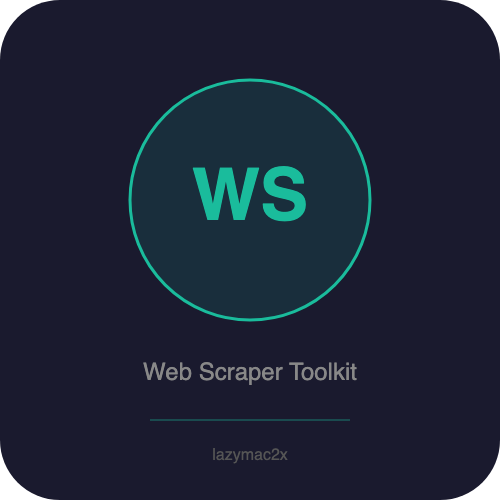

<p align="center"></p>

[](https://lazymac2x.github.io/lazymac-api-store/) [](https://coindany.gumroad.com/) [](https://mcpize.com/mcp/web-scraper-toolkit)

# web-scraper-toolkit

> ⭐ **Building in public from $0 MRR.** Star if you want to follow the journey — [lazymac-mcp](https://github.com/lazymac2x/lazymac-mcp) (42 tools, one MCP install) · [lazymac-k-mcp](https://github.com/lazymac2x/lazymac-k-mcp) (Korean wedge) · [lazymac-sdk](https://github.com/lazymac2x/lazymac-sdk) (TS client) · [api.lazy-mac.com](https://api.lazy-mac.com) · [Pro $29/mo](https://coindany.gumroad.com/l/zlewvz).

[](https://www.npmjs.com/package/@lazymac/mcp)
[](https://smithery.ai/server/lazymac/mcp)
[](https://coindany.gumroad.com/l/zlewvz)
[](https://api.lazy-mac.com)

> 🚀 Want all 42 lazymac tools through ONE MCP install? `npx -y @lazymac/mcp` · [Pro $29/mo](https://coindany.gumroad.com/l/zlewvz) for unlimited calls.

Universal web scraping API — extract structured data from any website. Metadata, links, headlines, images, tables, text, or custom CSS selectors. REST API + MCP server.

## Quick Start

```bash
npm install
npm start  # http://localhost:3200
```

## API

### `GET /api/v1/scrape?url=...&mode=...`

| Param | Default | Options |
|-------|---------|---------|
| `url` | required | Any URL |
| `mode` | `full` | `full, metadata, links, headlines, images, tables, text, custom` |
| `selector` | — | CSS selector (custom mode only) |

```bash
# Full scrape
curl "http://localhost:3200/api/v1/scrape?url=https://news.ycombinator.com"

# Just metadata (title, description, og:image)
curl "http://localhost:3200/api/v1/scrape?url=https://github.com&mode=metadata"

# Extract all links
curl "http://localhost:3200/api/v1/scrape?url=https://reddit.com&mode=links"

# Headlines only
curl "http://localhost:3200/api/v1/scrape?url=https://bbc.com&mode=headlines"

# Clean text (no HTML)
curl "http://localhost:3200/api/v1/scrape?url=https://example.com&mode=text"

# Custom CSS selector
curl "http://localhost:3200/api/v1/scrape?url=https://news.ycombinator.com&mode=custom&selector=.titleline>a"

# Tables
curl "http://localhost:3200/api/v1/scrape?url=https://en.wikipedia.org/wiki/List_of_countries&mode=tables"
```

### `POST /api/v1/scrape`

```bash
curl -X POST http://localhost:3200/api/v1/scrape \
  -H "Content-Type: application/json" \
  -d '{"url": "https://example.com", "mode": "metadata"}'
```

### `POST /api/v1/batch`

Scrape up to 10 URLs at once:

```bash
curl -X POST http://localhost:3200/api/v1/batch \
  -H "Content-Type: application/json" \
  -d '{"urls": ["https://github.com", "https://reddit.com"], "mode": "metadata"}'
```

## MCP Server

```bash
node src/mcp-server.js
```

Tools: `scrape_website`, `extract_text`, `batch_scrape`

## Modes

| Mode | Returns |
|------|---------|
| `full` | metadata + headlines + links + images + tables |
| `metadata` | title, description, og:image, canonical, favicon |
| `links` | all links with text |
| `headlines` | h1, h2, h3 tags |
| `images` | all img tags with alt text |
| `tables` | structured table data (headers + rows) |
| `text` | clean text content (no HTML) |
| `custom` | results matching your CSS selector |

## License

MIT

<sub>💡 Host your own stack? <a href="https://m.do.co/c/c8c07a9d3273">Get $200 DigitalOcean credit</a> via lazymac referral link.</sub>
